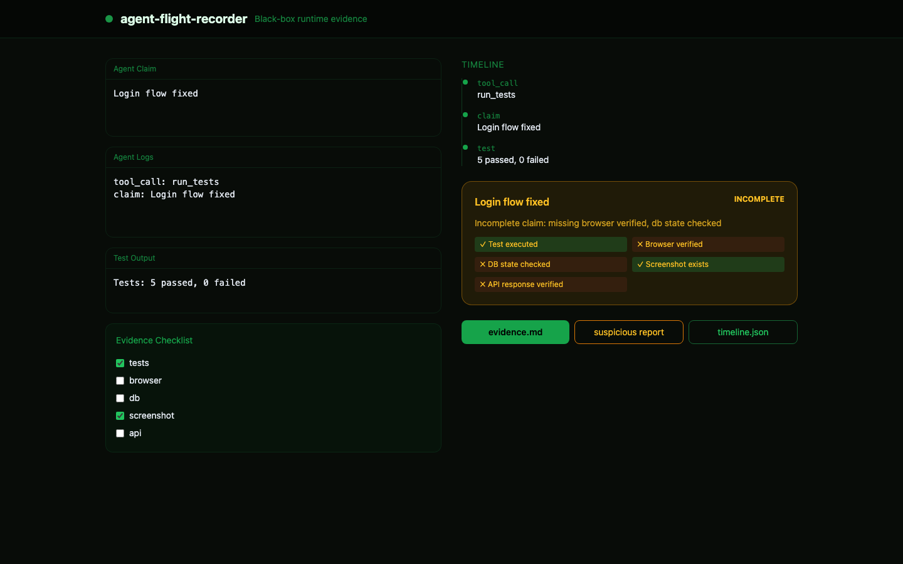

# agent-flight-recorder

> Black-box flight recorder for AI agent runs — timeline, evidence, and suspicious completion claims.

**Topics:** `ai-agents` · `agentic-ai` · `observability` · `qa` · `evidence` · `devtools` · `llm`



## Features

- Ingest agent logs, terminal output, git diff, test results
- Build chronological timeline
- Validate completion claims against evidence checklist
- Export `run.timeline.json`, `evidence.md`, `suspicious-claim-report.md`

## Quick Start

```bash
npm install
npm run dev      # http://localhost:3103
npm test
```

## Demo

```
Claim: Login flow fixed.
Evidence: test=yes, browser=no, db=no, screenshot=yes
Verdict: incomplete claim
```

## License

MIT — see [LICENSE](LICENSE).

## Author

**Mehmet Turac** — [github.com/mturac](https://github.com/mturac)
